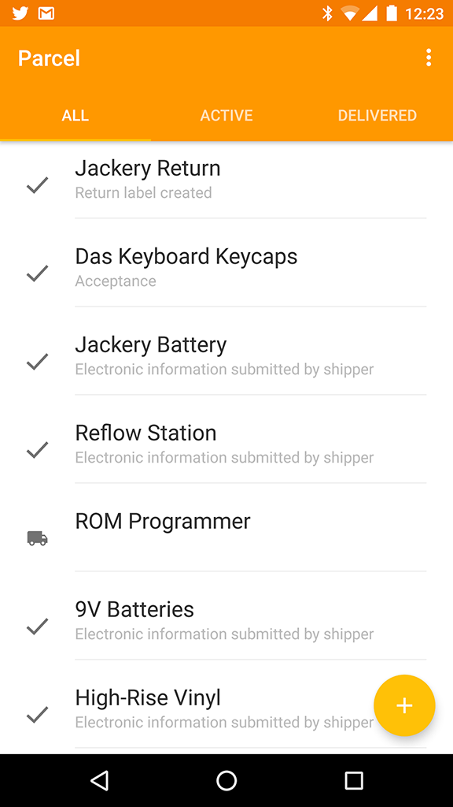

# Parcel for Android
An Android client for Parcel <https://parcelapp.net/>

## Supported Features
- [x] Authentication
- [x] Tracked packages
- [x] Package details
- [ ] Adding, editing, and deleting packages

## Building
Since Parcel uses Google Maps API, an API key is required. See [here](https://developers.google.com/maps/documentation/android-api/) for more information.

## License
parcel-android is released under an MIT license. See LICENSE for more information.
